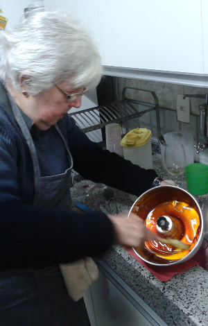

Pudim de leite condensado
=========================

Ingredientes
------------

**Pudim**

-   2 ovos

-   6 gemas

-   1 lata de leite condensado (395 g)

-   1,5 lata de leite integral (380 g)

**Calda**

-   4 xícaras de açúcar cristal

-   2 xícaras de água

-   1 colher de sopa de vinagre

Preparo
-------

**Calda**

1.  Aqueça o açúcar em panela grande e mexa enquanto derrete. Continue
    mexendo até que fique cor de caramelo claro.

2.  Adicione a água fervendo e o vinagre. Cuidado que espirra,
    proteja-se com uma tampa. Mexa imediatamente até dissolver.

3.  Deixe em ferver em fogo baixo até chegar ao ponto de fio. Verifique
    o ponto tomando um pouco com a colher e despejando. Se a calda
    descer em fio ao invés de parecer um líquido fluido estará no ponto.

4.  Espere esfriar para usar.

**Pudim**

1.  Passe calda por todo o interior de uma forma de pudim.

2.  Bata o leite condensado, o leite, os ovos e as gemas no liquidificador.

3.  Despeje a mistura batida na forma.
 

4.  Leve a forma a banho maria até que o pudim esteja cozido e
    sólido (30-40 min no fogão a fogo baixo).

5.  Se estiver usando uma panela de banho maria tire a água e deixe no
    fogo por mais 30 a 60 segundos, para caramelizar ainda mais a calda.

6.  desligue o fogo e deixe a forma esfriar completamente. Coloque na
    geladeira até que fique gelado.

7.  Passe uma faca fina pelas bordas do pudim para separá-lo da forma.
    Desenforme em uma prato grande.

Macetes
-------

-   A receita de calda é suficiente para vários pudins. Você pode
    fazê-la com antencedência e guardar em um vidro na geladeira.

-   Você pode aumentar a quantidade de calda no pudim se gostar. Mas
    certifique-se que todo o interior da forma esteja revestido de calda
    antes de jogar a mistura.

-   Há formas de banho-maria para fogão, como a que mostramos
    nas figuras. Com elas gasta-se menos gás e o pudim fica pronto
    mais rápido.

-   O maior segredo é o ponto de cozimento: deve ser o mínimo para que
    não desmonte, mas também não pode cozinhar demais ou
    fica borrachento. Com alguma experimentação você vai acertar.

