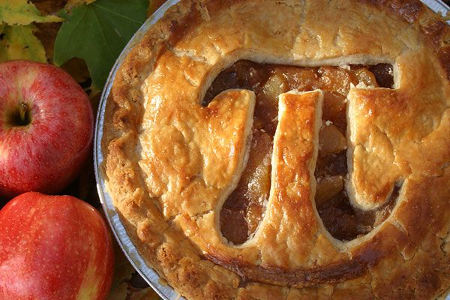

# O caderno Pi de receitas
## Paulo Inácio Prado
>A los amigos que vacilan en entrar a la cocina donde se encuentra, grita Heráclito:
> '¡Entrad, entrad! También aquí hay dioses.'
> Ortega Y Gasset

Em tempos de GitHub é aqui que vou colocar as receitas que peço e que me pedem.

O livro formatado está [aqui](https://www.gitbook.com/book/piklprado/receitas/)
