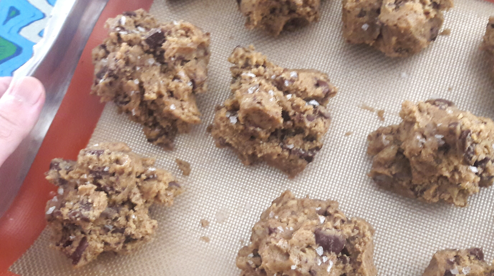

## Cookies perfeitos

Para 12 cookies:

### Ingredientes
* 225 g de manteiga
* 1 cubo de gelo
* 280 g de farinha de trigo
* 3/4 de colher de chá de bicarbonato de sódio (4 g)
* 12 pitadas de flor de sal.
* 140 g de açúcar branco
* 2 ovos grandes (100 g)
* 120 g de açúcar mascavo
* 2 colheres de chá de essência de baunilha (10 ml)
* 180 g de gotas de chocolate ou chocolate 70% picado

### Preparo

1. Em uma tigela misture a farinha, o açúcar mascavo, o chocolate e o
   bicarbonato. Reserve.
2. Derreta  manteiga em uma panela e mantenha no fogo até que fique de
   cor castanha.
3. Desligue o fogo, e espere 5 min. Acrescente o cubo de gelo e deixe
   derreter. Deixe esfriar até que comece a ficar a opaca nas bordas
   da panela (28-25 C).
4. Coloque na tigela da batedeira os ovos, o açúcar branco e a
   baunilha. Bata até virar uma creme claro e espesso (ca. 5 min em
   velocidade alta). Acrescente a manteiga derretida e bata até que
   esteja incorporada (cerca de mais 5 minutos). Deve ficar um creme
   uniforme e aerado.
5. Acrescente a mistura de ingredientes secos ao creme de manteiga e
   misture delicadamente com a colher. Misture apenas o suficiente
   para incorporar. Deve ficar um pouco mais coeso que uma farofa.
6. Cubra com filme plástico e leve à geladeira por no mínimo 8 h e
   máximo de três dias.
7. Para assar, preaqueça o forno a 175 C. Para forno elétrico deixe
   as resistências superior e inferior no máximo.
8. Retire a massa da geladeira e faça uma bola de 5-6 cm de diâmetro
   com uma colher de sorvete, tentando não amassar. Com a mão quebre a
   bola ao meio ou a esfarele e reconstitua deixando-a o menos
   compactada possível. Deve ficar com a superfície bem irregular (ver
   foto).
9. Coloque as bolas de massa em uma forma antiaderente, a uma
   distância equivalente ao seu diâmetro.
10. Asse apenas o suficiente para corar e formar um crosta fina.  Você
	vai ter que descobrir este ponto para seu forno, que deve estar
	entre 5 e 15 minutos (veja dicas). Vire a forma na metade do tempo
	de assar. Nesse momento salpique a flor de sal sobre cada
	biscoito.
11. Deixe esfriar na forma por 8 minutos e então transfira para uma
    grade e deixe descansar por 30 minutos. Guarde em recipiente hermético.

### Macetes

* Meu ideal de perfeição para cookies é que seja alto, com superfície
  irregular e com interior macio, úmido e caramelado. Pesquisei até
  encontrar a receita que mais se aproximava disso, que encontrei no
  site [http://www.seriouseats.com](Serious Eats). Lá está a
  explicação de cada passo da receita e também como variar para obter
  cookies com outras características. A minha receita têm umas poucas
  modificações.
* Para conseguir um cookie alto com interior macio é preciso que o
  exterior asse e forme uma casca rápido. Depois de experimentar
  bastante com meu forno elétrico cheguei ao tempo de 7 minutos a 175 C, com 
  as duas resistências no máximo, e na grade do meio. A vantagem do
  forno elétrico é que a resistência superior acelera a formação da
  casca de cima.
* A temperatura das bolinhas quando colocadas para assar também
    interfere muito.  Enquanto assa mantenha o resto da massa na
    geladeira. Em dias quentes faço as bolinhas e deixo todas no
    freezer por uma hora.
* Uma forma para cookies também ajuda a ter bons resultados. Ela é
  fina e aquece rápido. E em geral são antiaderentes. Ainda assim uso
  uma folha antiaderente reutilizável (compra-se em lojas de
  confeitaria).
* A flor de sal acentua o sabor do cookie, mas deve ser bem fina. Uso *Maldon salt*. 
* Você pode congelar as bolinhas prontas para assar depois.

  

  
> Receita adaptada de: The Best Chocolate Chip Cookies Recipe. The Food Lab - Unraveling the mysteries of home cooking through science. By J. Kenji López-Alt http://www.seriouseats.com/recipes/2013/12/the-food-lab-best-chocolate-chip-cookie-recipe.html
