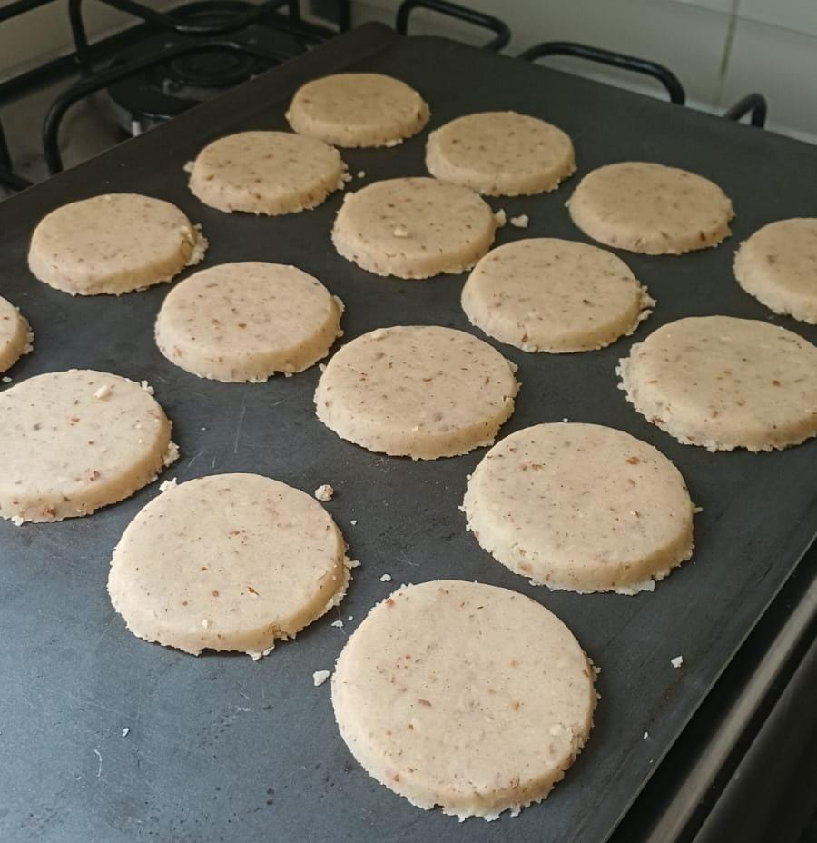
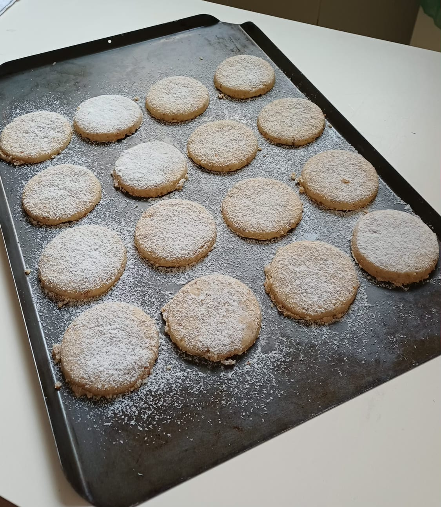

## Polvorones

### Ingredientes

* 230 g de azeite de oliva
* Casca de um limão siciliano ou Taiti
* 1/2 colher de chá de sementes de erva-doce
* 1/2 colher de chá de canela em pó
* Uma pitada de cravo em pó
* 115 g de açúcar refinado
* 500 g de farinha de trigo

### Modo de preparo

1. Coloque o azeite e casca de limão em uma panela grande o suficiente
   para fazer a massa. Aqueça e até a casca fritar. Apague o fogo e
   retire a casca de limão
2. Acrescente o anis e aqueça com cuidado até sentir o aroma do anis
   frito. Cuidado para não queimar as sementes. Apague o fogo.
3. Acrescente a canela, o cravo e o açúcar e misture bem, até que ao
   açucar se dissolva. Deixei esfriar.
4. Quando a mistura estiver fria, incorpore a farinha aos poucos,
   misturando primeiro com a colher e depois com as mãos. A massa fica
   úmida de óleo mas quebradiça, como areia molhada.
5. Junte a massa em uma bola, embrulhe em filme plástico ou num saco
   plástico e deixe descansar na geladeira por pelo menos 1 horas.
6. Para moldar os biscoitos, espalhe a massa sobre um pedaço de filme
   plástico ou uma superfície não aderente. Coloque outro retângulo de
   filme plástico por cima e abra com um rolo de massa, até ter uma
   cada de altura uniforme de 0,5 cm. 
7. Corte os biscoitos com um cortador redondo de 6 cm de diâmetro e
   com muito cuidado use uma espátula para transferir os biscoitos
   para assadeira. Disponha os biscoitos com uma distância pequena (1
   cm) entre eles, pois não crescem. Não precisa untar.
8. Asse em forno baixo (150°C em forno elétrico ou de convecção, a até 170°C
   em forno a gás) por 30 minutos ou até que as bordas comecem a
   corar.
9. Retire do forno e polvilhe açúcar de confeiteiro sobre os
   biscoitos. Deixe esfriar por pelo menos 30 minutos. retire da forma
   com uma espátula, com muito cuidado, pois são quebradiços.
10. Disponha com cuidado em recipientes herméticos.
   
   
### Variantes
* Acrescente 150g de amêndoas moídas fino ou farinha de amêndoa,
reduzindo a farinha para 450g

> Receita de Eulalia Quintana Moscoso, adaptada por seu neto António López de Prado e seu bisneto Paulo Inácio Prado.

	
