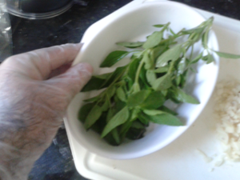
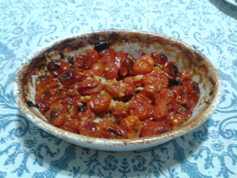

## Tomatins assadins

### Ingredientes

* 360 g de tomate *grape*
* 1 cabeça de alho
* Meio maço de manjericão
* 50 ml de azeite
* Sal grosso moído grosseiramente ou *Maldon salt*

### Preparo

1. Lave e seque o manjericão e coloque no fundo de um refratário pequeno (20 x 10 cm aproximadamente).
2. Lave e seque os tomates e coloque no refratário.
3. Descasque os dentes de alho, corte em lâminas finas ou em pequenos pedaços e misture aos tomates.
4. Espalhe o sal sobre os tomates.
5. Regue com o azeite.
6. Leve ao forno médio (180 C) pré aquecido. Não cubra.
7. Deixe assar por uma hora ou mais, até que esteja seco, apenas com o azeite no fundo. Os tomates estarão secos e os de cima ligeiramente gratinados.

