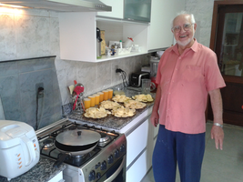
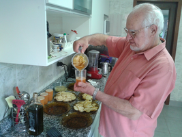
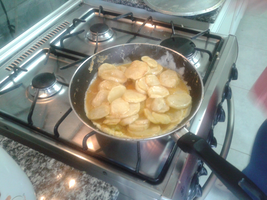
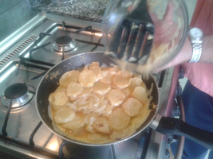
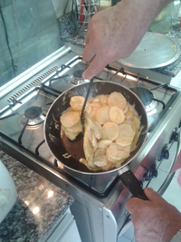
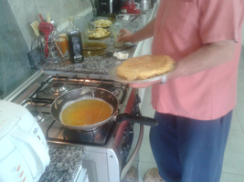
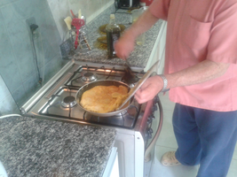
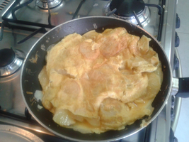
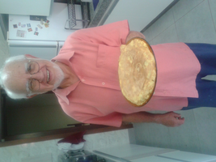

## Tortilla (Paco Prado)

### Ingredientes
* 250 ml de ovos (5-6 ovos)
* 750 g de batatas (ca. 5 batatas médias)
* Cerca de 250 ml de azeite
* Um quarto de cebola média
* Sal a gosto

### Preparo

1. Bata os ovos com uma colher de chá de sal e reserve em uma tigela ou jarra que comporte as batatas.
2. Corte a cebola em rodelas ou pique-a. Frite-a em duas colheres de sopa de azeite em uma frigideira antiaderente funda
até que fiquem transparentes. Escorra em papel absorvente e reserve.
3. Descasque as batatas e corte-as em rodelas de 1 cm de espessura.
4. Na mesma frigideira em que fritou as cebolas adicione mais azeite até que tenha altura para cobrir uma camada de batatas.
Aqueça e frite as batatas dos dois lados até que estejam coradas, mas não crocantes.
5. Coloque as batatas em papel absorvente e salgue-as
dos dois lados. Quando as batatas esfriarem mergulhe-as na tigela de ovos batidos.
6. Reserve o azeite usado nas frituras para fritar as tortilhas.
7. Separe metade dos ovos batidos.
8. **Faça a primeira parte da tortilha**: Aqueça duas colheres de sopa do azeite na mesma frigideira. Despeje a metade dos ovos e todas as batatas. Adicone metade das cebolas. Com cuidado dê forma à tortilha, e levante seus lados para que o ovo se distribua por igual. Controle o fogo para que o ovo cozinhe sem que a parte de baixo queime. Assim que todo o ovo coagular vire esta parte da tortilha em uma tampa de panela de diâmetro maior que a frigideira.
9. **Faça a segunda parte**: adicione mais uma colher de sopa de azeite à frigideira e adicione o restante do ovo batido e das cebolas. Assim que começar a coagular despeje a primeira parte por cima.
10. Espere até que as duas partes estejam unidas. Controle o fogo e vire a tortilha com auxílio da tampa de panela, até que esteja bem no ponto desejado. Sirva imediatamente, ou mantenha em forno aquecido.

### Variantes

* Acrescente toucinho ou um bom salame espanhol, fritos juntos com a cebola.
* Adicione salsa, cebolinha ou tomilho.
