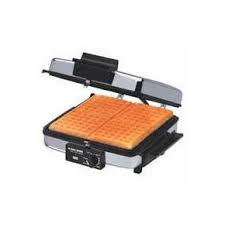

## Waffles canadenses 

### Ingredientes
* 600g (4 xícaras) de farinha de trigo
* 3/4 colheres de chá de sal
* 1 colher de chá de fermento químico
* 800g (3 1/2 xícaras) de leite azedo ou coalhada
* 1 colher de chá de bicarbonato
* 4 ovos
* 100g (4 colheres de sopa) de manteiga amolecida
* 140g (7 colheres de sopa) de açúcar

### Preparo
1. Bater tudo no liquidificador
2. Pré-aqueça a máquina de assar waffles na temperatura adequada.
3. Colocar a massa na máquina até cobrir toda a chapa. Assar conforme o tempo indicado no manual da máquina.

### Macetes
* Os waffles podem ser congelados. Neste caso asse-os um pouco menos. Para consumir descongele no microondas por 30 segundos/waffle e então esquente na torradeira.
* Se possível deixe a massa descansar meia hora antes de assar. Se fizer isso, use os fermentos químicos que são ativados com o calor, como o da Oetker. O da Royal começa a agir com a umidade e não é bom para isso.
* A massa fica bem densa e exige um liquidificador forte. Na dúvida faça metade da receita por vez.
* O tempo para assar depende do aparelho. No meu (figura) é de 6,5 min. Consulte o manual.

> Receita de Heidi Dolder
